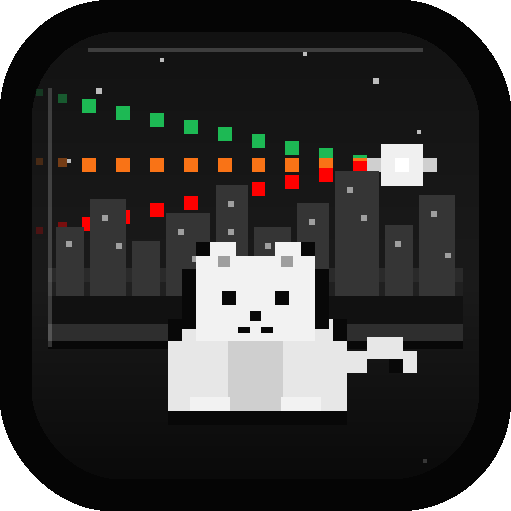

<p align="center">
  
</p>

# Omnia

Omnia 是一款面向 macOS 的第三方音乐播放器，目标是把 Spotify、YouTube Music 和网易云音乐聚合到一个统一、干净的桌面播放器里。应用提供搜索、播放、歌词、收藏、歌单和播放队列等核心体验，让不同平台的音乐可以在同一个窗口中管理和播放。

## 主要功能

### 多平台聚合

- 支持 Spotify、YouTube Music、网易云音乐三个平台。
- 三个平台账号独立登录、独立管理，可同时保持登录状态。
- 歌曲、歌单、收藏和推荐内容保留来源平台标识，方便区分音乐来源。

### 统一搜索

- 一个搜索框同时查询多个音乐平台。
- 支持按平台筛选搜索结果。
- 搜索结果覆盖歌曲、专辑、艺术家和歌单等常见内容类型。
- 输入搜索词时自动防抖，减少频繁请求带来的卡顿。

### 音乐播放

- 支持播放、暂停、停止、上一首、下一首。
- 支持播放队列管理。
- 支持播放进度拖拽和毫秒级定位。
- 支持音量调节，并记忆上次音量。
- 支持顺序播放、单曲循环和随机播放。
- 支持键盘媒体键控制播放。
- 支持在 macOS 锁屏和系统媒体中心显示当前播放信息、封面和进度。

### 歌词体验

- 支持从不同平台获取歌词。
- 优先展示逐字歌词；无逐字歌词时自动降级为逐行歌词。
- 当前歌词行自动居中并平滑滚动。
- 支持逐字高亮，当前字、已播放文字和未播放文字有不同显示状态。
- 无歌词时提供明确的空状态提示。

### 我的音乐库

- 支持读取各平台收藏歌曲。
- 支持读取各平台歌单。
- 支持从歌单或收藏中直接播放歌曲。
- 支持一键把歌单内容加入播放队列。

### 首页推荐

- 聚合展示不同平台的推荐内容。
- 支持最近播放、每日推荐、推荐歌单等首页内容。
- 通过统一的列表和卡片样式呈现不同来源的音乐。

### 播放队列与歌单操作

- 支持查看当前播放队列。
- 支持从歌曲列表中添加歌曲到队列。
- 支持将歌曲加入可用歌单。
- 支持从歌单中移除歌曲。

### 深色桌面界面

- 采用 macOS 原生风格窗口和深色播放器界面。
- 左侧为导航栏，中间为主内容区，底部为常驻播放控制栏。
- 底部播放栏展示封面缩略图、歌曲名、歌手、播放按钮、进度条、循环/随机、歌词、队列和音量控制。
- 歌词页支持沉浸式展示，并可结合封面颜色营造背景氛围。
- 设置页用于管理账号、播放偏好和应用行为。

## 支持平台

| 平台 | 支持内容 |
| --- | --- |
| Spotify | 登录、搜索、播放、歌词、推荐、收藏/歌单 |
| YouTube Music | 登录、搜索、播放、歌词、推荐、收藏/歌单 |
| 网易云音乐 | 登录、搜索、播放、歌词、每日推荐、收藏/歌单 |

## 账号与数据

- 登录通过应用内窗口完成，应用会保存必要的登录凭证用于下次启动自动恢复登录状态。
- 各平台登录状态相互独立，可以只登录其中一个平台使用。
- 播放历史、应用设置和登录状态保存在本地。
- 应用不提供离线缓存，音乐内容会在播放时实时获取。

## 界面结构

```text
┌─────────────────────────────────────────────────────────┐
│  侧边栏          │  主内容区                              │
│  搜索            │  首页 / 搜索 / 我的库 / 设置             │
│  首页            │                                       │
│  我的库          │  歌曲列表、歌单、推荐内容、歌词视图       │
│  平台账号        │                                       │
│  设置            │                                       │
├──────────────────┴──────────────────────────────────────┤
│  底部播放栏：封面 / 歌名 / 控制按钮 / 进度条 / 队列 / 音量 │
└─────────────────────────────────────────────────────────┘
```

## 注意事项

Omnia 是第三方音乐播放器，不隶属于 Spotify、YouTube Music 或网易云音乐。使用时需要遵守对应平台的服务条款和所在地区的相关规定。部分歌曲、歌词或推荐内容可能受账号权限、地区限制或平台接口变化影响而不可用。
